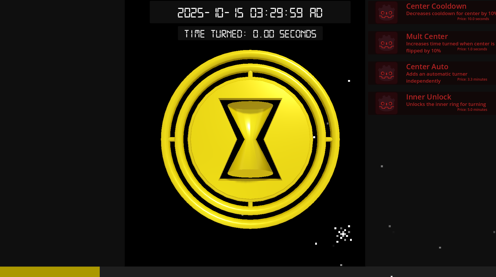
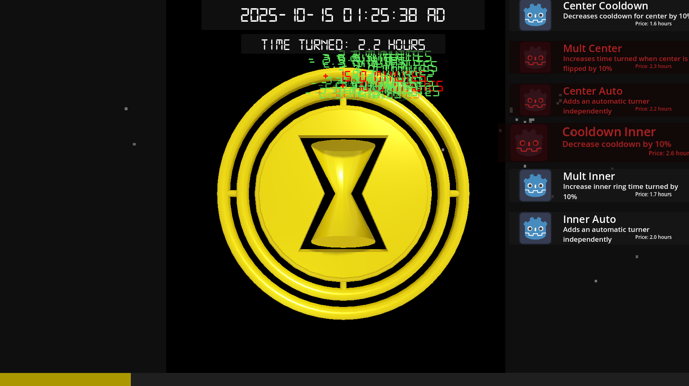

# TimeTurner

<!-- PROJECT SHIELDS -->
<!--
*** I'm using markdown "reference style" links for readability.
*** Reference links are enclosed in brackets [ ] instead of parentheses ( ).
*** See the bottom of this document for the declaration of the reference variables
*** for contributors-url, forks-url, etc. This is an optional, concise syntax you may use.
*** https://www.markdownguide.org/basic-syntax/#reference-style-links
-->
<!--
[![Contributors][contributors-shield]][contributors-url]
[![Forks][forks-shield]][forks-url]
[![Stargazers][stars-shield]][stars-url]
[![Issues][issues-shield]][issues-url]
[![Unlicense License][license-shield]][license-url]
[![LinkedIn][linkedin-shield]][linkedin-url]-->

<!-- PROJECT LOGO -->
<!--
 

  

  <h3 align="center">Best-README-Template</h3>

  

	An awesome README template to jumpstart your projects!
	 
	<a href="https://github.com/othneildrew/Best-README-Template"><strong>Explore the docs »</strong></a>
	 
	 
	<a href="https://github.com/othneildrew/Best-README-Template">View Demo</a>
	&middot;
	<a href="https://github.com/othneildrew/Best-README-Template/issues/new?labels=bug&template=bug-report---.md">Report Bug</a>
	&middot;
	<a href="https://github.com/othneildrew/Best-README-Template/issues/new?labels=enhancement&template=feature-request---.md">Request Feature</a>
  

-->

<!-- TABLE OF CONTENTS -->

  
Table of Contents

  <ol>
	<a href="#about-the-project">About The Project</a>
	<li><a href="#built-with">Built With</a></li>
	</ul>
	<li><a href="#play">How to play?</a></li>
	<li><a href="#roadmap">Roadmap</a></li>
	<li><a href="#license">License</a></li>
	<li><a href="#contact">Contact</a></li>
	<li><a href="#acknowledgments">Acknowledgments</a></li>
  </ol>

<!-- ABOUT THE PROJECT -->
## About The Project

### Overall
Built for Hackclub Siege W6, this was more of a one and done. The theme, magic, was kind of difficult to think of something for without continuing one of my past projects (which I didn't really want to do). It came out alright, but it feels so incomplete since I spent about half the time I did for this one than compared to my other siege projects. Oh well.

### What even is this?
Super simple clicker game that turns time backwards! Inspired by the Harry Potter series's timeturner, you slowly turn back time until you can't anyore. Why? Ask yourself that. Here's a nice feature list:
* Center and one ring of time turning
* 3 sets of upgrades
* Time display which parses the time data into human readable things like 12478 BC or 8 billion years after the big bang
* Animated time turning
* Weird background that follows your cursor

### What do I take out of this?
Quaternions are so useful. Impulse exists. Gyroscopes resist turning in more than one axis. Quaternions suck. Also, that I should learn blender instead of usign CSG over and over again. It's not good for the computer to do all of that math all the time...
I think the most important thing is to pick good ideas for the timeframe, since ideas that are too big would mean an unfinished product which - despite the idea being better - is overall worse than a polished worse idea.

### Screenshots
They’re fairly large, so I’ve tucked them into expandable sections:

  
<strong>First one</strong>

  

  
<strong>Second one</strong>

  

(<a href="#readme-top">back to top</a>)

<!--
### Built With

This section should list any major frameworks/libraries used to bootstrap your project.

* [![Godot][Godot 4.4]][Godot-url]
<!--
* [![Next][Next.js]][Next-url]
* [![React][React.js]][React-url]
* [![Vue][Vue.js]][Vue-url]
* [![Angular][Angular.io]][Angular-url]
* [![Svelte][Svelte.dev]][Svelte-url]
* [![Laravel][Laravel.com]][Laravel-url]
* [![Bootstrap][Bootstrap.com]][Bootstrap-url]
* [![JQuery][JQuery.com]][JQuery-url]-->

### Play 

If you'd like to build it yourself, I used Godot 4.4.1. I do have a pre-built web version available [here on my itch](https://pixelsaver.itch.io/Time-Turner), but if you still insist on building this unoptimized mess, go ahead.

1. Install Godot 4.4
2. Download and unzip the code
3. Open the file with Godot project manager
4. Go to Project > Export, add whichever platform you're on (MacOS, Windows) and then click export.
5. You're good to go!

(<a href="#readme-top">back to top</a>)

<!-- ROADMAP -->
## Roadmap

- [x] Make the timeturner
- [x] Let the timeturner spin
- [x] Two axis spinning
- [x] Add a clock
	- [x] Decrement clock based on time turned
	- [x] Let the clock go all the way back to the big bang
- [ ] Make ending cutscene for reaching the big bang
- [ ] Add all upgrades
	- [x] Multipliers for time earned
	- [x] Cooldown for time turning
	- [x] Automatic time turning
	- [x] Unlock Inner ring
	- [ ] Cooldown for automatic
	- [ ] Further upgrades that make you overpowered
- [ ] Balance the game

(<a href="#readme-top">back to top</a>)

<!-- LICENSE -->
## License

Distributed under the MIT License. See `LICENSE` for more information.

(<a href="#readme-top">back to top</a>)

<!-- CONTACT -->
## Contact

Pixel Saver - [itch.io](https://pixelsaver.itch.io/) 

Project Link: [https://github.com/PixelSaver/Time-Turner](https://github.com/PixelSaver/Time-Turner)

(<a href="#readme-top">back to top</a>)

<!-- ACKNOWLEDGMENTS -->
## Acknowledgments

Many thanks for these people for letting me use their work for free!

* The clock font, [Style-7 Font: Sizenko Alexander](http://www.styleseven.com)
<!--
* [Choose an Open Source License](https://choosealicense.com)
* [GitHub Emoji Cheat Sheet](https://www.webpagefx.com/tools/emoji-cheat-sheet)
* [Malven's Flexbox Cheatsheet](https://flexbox.malven.co/)
* [Malven's Grid Cheatsheet](https://grid.malven.co/)
* [Img Shields](https://shields.io)
* [GitHub Pages](https://pages.github.com)
* [Font Awesome](https://fontawesome.com)
* [React Icons](https://react-icons.github.io/react-icons/search)
-->

(<a href="#readme-top">back to top</a>)

<!-- MARKDOWN LINKS & IMAGES -->
<!-- https://www.markdownguide.org/basic-syntax/#reference-style-links -->
[contributors-shield]: https://img.shields.io/github/contributors/othneildrew/Best-README-Template.svg?style=for-the-badge
[contributors-url]: https://github.com/othneildrew/Best-README-Template/graphs/contributors
[forks-shield]: https://img.shields.io/github/forks/othneildrew/Best-README-Template.svg?style=for-the-badge
[forks-url]: https://github.com/othneildrew/Best-README-Template/network/members
[stars-shield]: https://img.shields.io/github/stars/othneildrew/Best-README-Template.svg?style=for-the-badge
[stars-url]: https://github.com/othneildrew/Best-README-Template/stargazers
[issues-shield]: https://img.shields.io/github/issues/othneildrew/Best-README-Template.svg?style=for-the-badge
[issues-url]: https://github.com/othneildrew/Best-README-Template/issues
[license-shield]: https://img.shields.io/github/license/othneildrew/Best-README-Template.svg?style=for-the-badge
[license-url]: https://github.com/othneildrew/Best-README-Template/blob/master/LICENSE.txt
[linkedin-shield]: https://img.shields.io/badge/-LinkedIn-black.svg?style=for-the-badge&logo=linkedin&colorB=555
[linkedin-url]: https://linkedin.com/in/othneildrew
[product-screenshot]: images/screenshot.png

[Godot]: https://godotengine.org/assets/press/icon_monochrome_dark.png
[Godot-url]: [https://github.com/godotengine/godot](https://godotengine.org)

[Next.js]: https://img.shields.io/badge/next.js-000000?style=for-the-badge&logo=nextdotjs&logoColor=white
[Next-url]: https://nextjs.org/
[React.js]: https://img.shields.io/badge/React-20232A?style=for-the-badge&logo=react&logoColor=61DAFB
[React-url]: https://reactjs.org/
[Vue.js]: https://img.shields.io/badge/Vue.js-35495E?style=for-the-badge&logo=vuedotjs&logoColor=4FC08D
[Vue-url]: https://vuejs.org/
[Angular.io]: https://img.shields.io/badge/Angular-DD0031?style=for-the-badge&logo=angular&logoColor=white
[Angular-url]: https://angular.io/
[Svelte.dev]: https://img.shields.io/badge/Svelte-4A4A55?style=for-the-badge&logo=svelte&logoColor=FF3E00
[Svelte-url]: https://svelte.dev/
[Laravel.com]: https://img.shields.io/badge/Laravel-FF2D20?style=for-the-badge&logo=laravel&logoColor=white
[Laravel-url]: https://laravel.com
[Bootstrap.com]: https://img.shields.io/badge/Bootstrap-563D7C?style=for-the-badge&logo=bootstrap&logoColor=white
[Bootstrap-url]: https://getbootstrap.com
[JQuery.com]: https://img.shields.io/badge/jQuery-0769AD?style=for-the-badge&logo=jquery&logoColor=white
[JQuery-url]: https://jquery.com 
